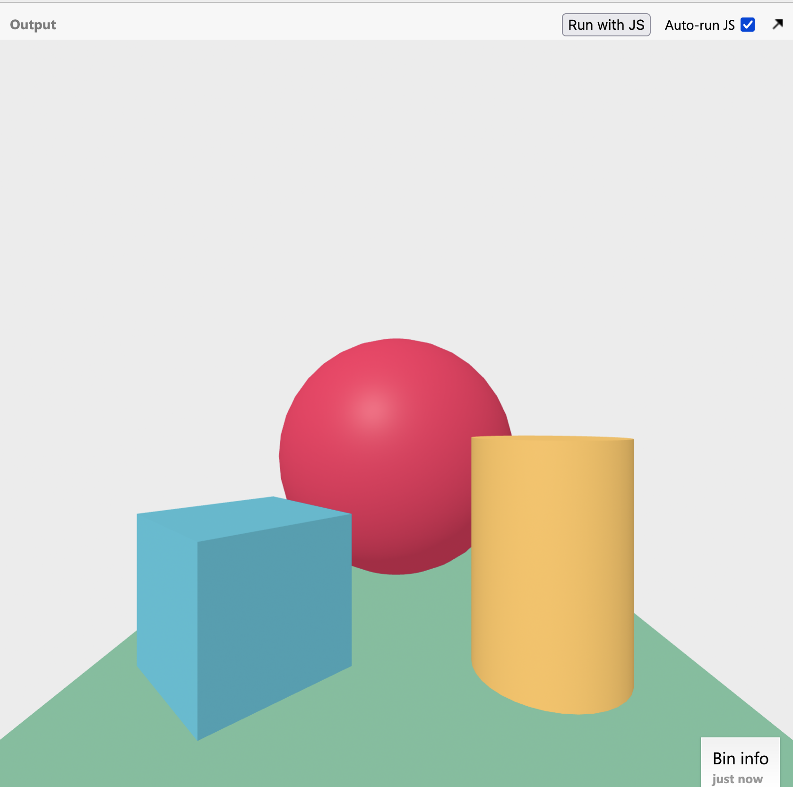

# Tool Learning Log

Tool: **A-Frame**

---

03/25/24:
Hello. This is my first time working with A-Frame. Some things that I am seeing as of right now, just from opening the strter code is that it doesn't seem too hard to make shapes. You just type the shape name, and you get the shape. I imagined it woud be way harder, having to do stuff like adjust spectating perimeter, set axis, etc. It's actually pretty straightforward. You can edit the starter code to



[I'm using this playlist to help me along my journey of A-Frame experimentation.](https://youtube.com/playlist?list=PL8MkBHej75fJD-HveDzm4xKrciC5VfYuV&si=vvkXc965tx72R9i0)
I'm currently on [video 3](https://youtube.com/playlist?list=PL8MkBHej75fJD-HveDzm4xKrciC5VfYuV&si=vvkXc965tx72R9i0), and right now theres already an influx of information on the attributes you can do to the object in the sandbox.

* ```segments-radial ``` is how many sides your circle has

* ```open-ended``` hollows out the object

* ```side=double``` makes the object visible from both sides (makes it appear like a 3d object, it seems it glitches out if you dont do this step)

4/4/24:
* Learned how to make a hollowed out cone / semi-sphere


<!--
* Links you used today (websites, videos, etc)
* Things you tried, progress you made, etc
* Challenges, a-ha moments, etc
* Questions you still have
* What you're going to try next
-->
